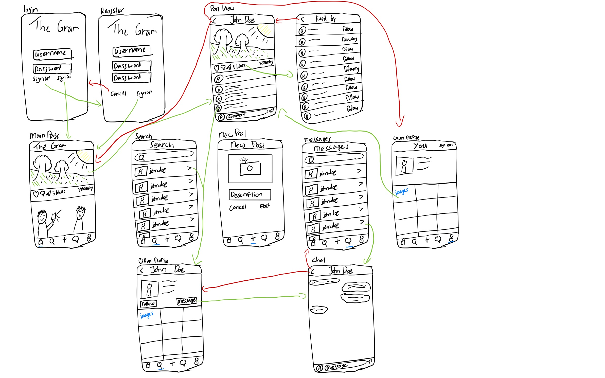

# Analysis Document

#### Tommy Goossens - Semester 6

##### V0.1

### Versiebeheer

| Versie | Datum      | Wijzigingen  |
| ------ | ---------- | ------------ |
| v0.1   | 10-04-2020 | Eerste opzet |

### Verspreidingen

| Versie | Datum | Ontvangers |
| ------ | ----- | ---------- |

 

---

## Inhoudsopgave

- [Analysis Document](#analysis-document)
      - [Tommy Goossens - Semester 6](#tommy-goossens---semester-6)
        - [V0.1](#v01)
    - [Versiebeheer](#versiebeheer)
    - [Verspreidingen](#verspreidingen)
  - [Inhoudsopgave](#inhoudsopgave)
  - [The Gram](#the-gram)
  - [Schetsen](#schetsen)
  - [Requirements](#requirements)
    - [Functional requirements](#functional-requirements)
  - [Non-functional requirements](#non-functional-requirements)

## The Gram

**The Gram** is een sociaal platform waar gebruikers hun mooiste en/of leukste foto’s kunnen delen met de rest van de wereld. Gebruikers van het platform kunnen nieuwe vrienden maken door andere gebruikers te volgen en met hen te chatten.
De applicatie is gemaakt in Swift en zal alleen voor iPhone gebruikers beschikbaar zijn. De backend wordt ontwikkeld met behulp van het .Net Core 3.1 framework.
Instagram (waar The Gram op gebaseerd is) heeft 1 miljard maandelijkse gebruikers, waarvan er meer dan 500 miljoen dagelijks actief zijn (Statista, 2018). Op basis van deze cijfers zal ik ook mijn technologie keuzes baseren.

## Schetsen

Onderstaand zijn schetsen te vinden van de interface van de iOS applicatie. De pijltjes duiden de navigatie aan tussen de componenten.

## Requirements

Onderstaand zijn alle requirements genoteerd onderverdeeld in functional requirements en non functional requirements.

### Functional requirements

Functionele requirements beschrijven de manier waarop de applicatie zich gedraagt / bedient wordt.

| Id   | Requirement                                                                           |
| ---- | ------------------------------------------------------------------------------------- |
| F-1  | Gebruiker moet kunnen inloggen met email & wachtwoord                                 |
| F-2  | Gebruiker moet kunnen uitloggen                                                       |
| F-3  | Gebruiker moet zichzelf kunnen registreren                                            |
| F-4  | Gebruiker moet een nieuwe foto kunnen plaatsen                                        |
| F-5  | Gebruiker moet een begeleidende tekst kunnen invoeren bij een foto                    |
| F-6  | Gebruiker moet gebruikers kunnen zoeken op basis van naam                             |
| F-7  | Gebruiker moet gebruikers kunnen zoeken op basis van email                            |
| F-8  | Gebruiker moet andere gebruikers kunnen volgen                                        |
| F-9  | Gebruiker moet andere gebruikers kunnen ontvolgen                                     |
| F-10 | Gebruiker moet de posts van andere gebruikers kunnen zijn in zijn feed                |
| F-11 | Gebruiker moet een bericht van een andere gebruiker kunnen liken                      |
| F-12 | Gebruiker moet een reactie kunnen plaatsen onder een bericht                          |
| F-13 | Gebruiker moet een bericht kunnen delen met een andere gebruiker                      |
| F-14 | Gebruiker moet zijn eigen profiel kunnen inzien                                       |
| F-15 | Gebruiker moet een overzicht kunnen inzien van iedereen die hij volgt                 |
| F-16 | Gebruiker moet kunnen chatten met een andere gebruiker                                |
| F-17 | Gebruiker moet een overzicht krijgen van alle openstaande chats                       |
| F-18 | Bij het openen van een chat krijgt de gebruiker de chat historie te zien              |
| F-19 | Het systeem valideert de authenticiteit van de gebruikers met Firebase Authentication |
| F-20 | Het systeem slaat de afbeeldingen op in Firebase Storage                              |
| F-21 | De services worden gedeployed in een Kubernetes cluster                               |
| F-22 | Het systeem zal over een API gateway beschikken                                       |
| F-23 | Een message queue zal de communicatie tussen de services onderling gaan afhandelen    |
| F-24 | Code kwaliteit wordt door sonarqube gecontroleerd                                     |
| F-25 | Componenten van het systeem worden getest door middel van unit tests                  |
| F-26 | De integratie van componenten worden getest door middel van integratie testen         |
| F-27 | Het volledige systeem wordt getest met e2e tests                                      |

## Non-functional requirements

Non-functional requirements, ook wel kwaliteitsattributen genoemd, beschrijven het karakter van de architectuur.

| Id    | Description                                                                                            |
| ----- | ------------------------------------------------------------------------------------------------------ |
| NF-1  | De iOS applicatie ondersteunt iPhone devices vanaf iOS 12                                              |
| NF-2  | Communicatie verloopt alleen via HTTPS                                                                 |
| NF-3  | Het systeem zal een uptime garanderen van 99%                                                          |
| NF-4  | Het systeem zal 100 uur mean time between failure (MTBF) bereiken                                      |
| NF-5  | Wanneer het hele systeem offline is zal de gebruiker een melding zien dat het systeem onbeschikbaar is |
| NF-6  | Wanneer een service offline is zal de overige functionaliteit blijven werken                           |
| NF-7  | Elke service moet onafhankelijk up te daten zijn                                                       |
| NF-8  | Het systeem moet 500 miljoen gelijktijdige gebruikers aan kunnen                                       |
| NF-9  | De unit testen zullen op zijn minst 80% van de code bedekken                                           |
| NF-10 | Testen worden automatisch uitgevoerd in de pipeline voor het CI/CD onderdeel                           |
| NF-11 | Chat berichten dienen binnen 1 seconde bij de ontvangende kant aan te komen                            |
| NF-12 | Het feed onderdeel mag maximaal 10 berichten per keer binnenhalen om de snelheid te behouden           |
| NF-13 | Een gebruiker mag niet langer dan een seconde wachten op een nieuw UI component                        |
| NF-14 | Exceptions worden correct opgevangen                                                                   |
| NF-15 | Opgevangen exceptions worden gelogd in log files                                                       |
| NF-16 | Gebruikers zonder account mogen geen requests sturen naar de backend                                   |
| NF-17 | Gebruikers mogen niet in naam van een andere gebruiker berichten plaatsen                              |
| NF-18 | De iOS applicatie dient makkelijk in gebruikt te zijn voor mensen vanaf                                |
