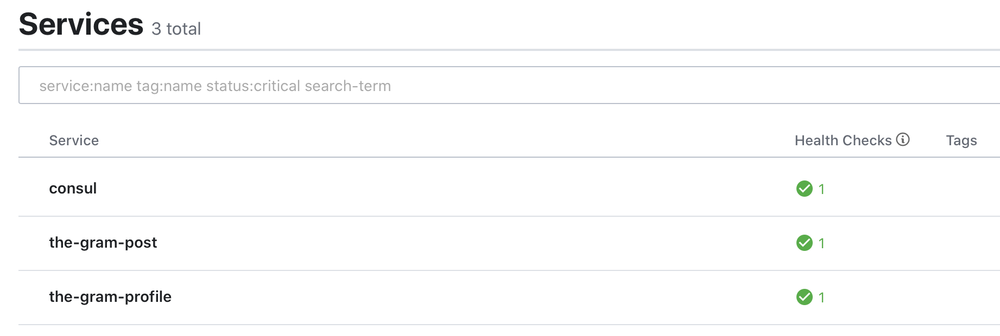
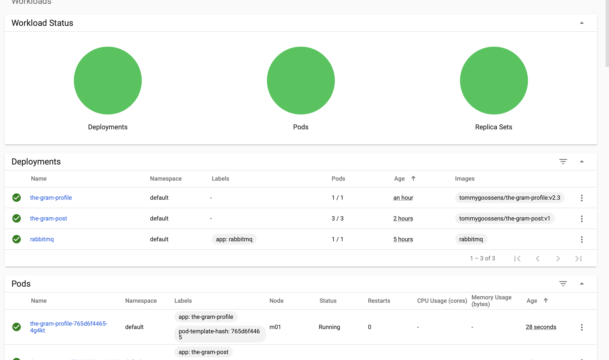
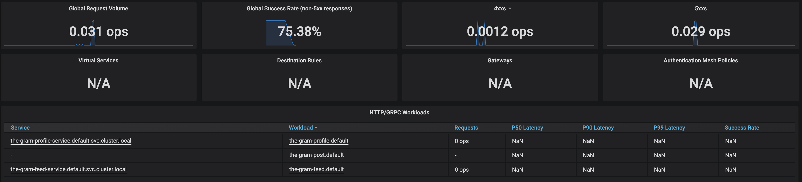
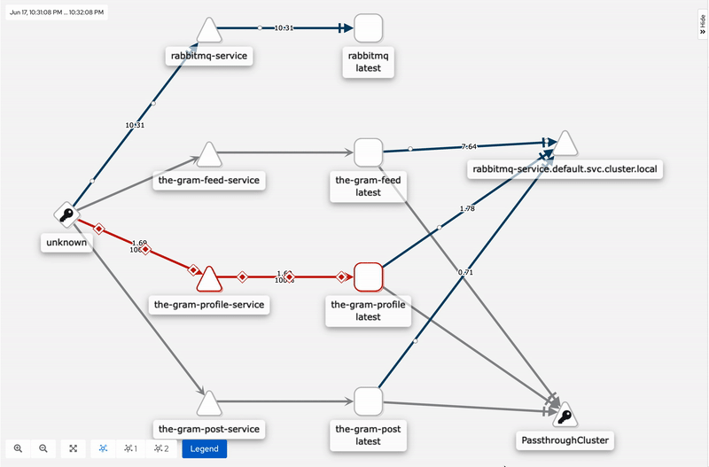
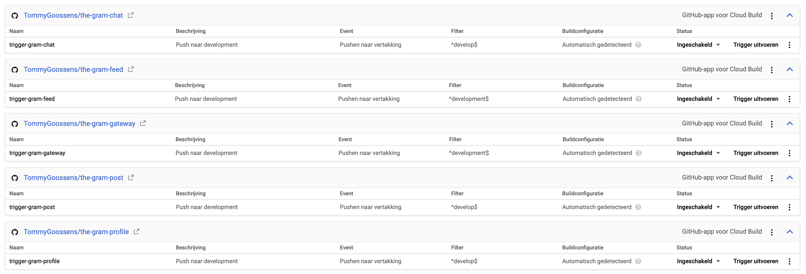
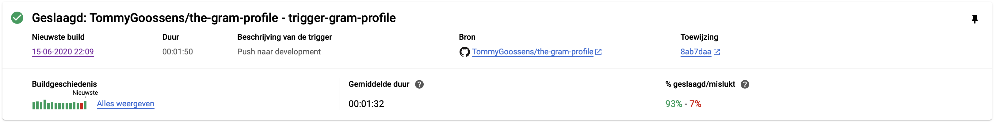

# Personal Development Report

#### Tommy Goossens - Semester 6

##### V2.3

## Versiebeheer

| Versie | Datum      | Wijzigingen                                                                     |
| ------ | ---------- | ------------------------------------------------------------------------------- |
| v0.1   | 27-03-2020 | Eerste opzet                                                                    |
| v0.2   | 05-04-2020 | Versie voor week 7                                                              |
| v0.3   | 05-04-2020 | Versie 0.2 verbeterd aan de hand van feedback van Jolanda                       |
| v1.0   | 10-04-2020 | Versie 0.3 goedgekeurd door Jolanda                                             |
| v1.1   | 15-05-2020 | Hoofdstukken 1,2,3 en 4 bijgewerkt voor de derde versie van het PDR             |
| v1.2   | 29-05-2020 | Hoofdstukken 5,6 bijgewerkt voor de derde versie van het PDR                    |
| v2.1   | 13-06-2020 | Hoofdstukken 1,2,3 bijgewerkt op basis van feedback naar proficient             |
| v2.2   | 15-06-2020 | Hoofdstukken 4,5,6,8 bijgewerkt + onderzoek naar data schaalbaarheid toegevoegd |
| v2.3   | 17-06-2020 | Hoofdstukken 4 en 7 bijgewerkt                                                  |
| v3.0   | 22-06-2020 | Reflectie & Conclusie                                                           |
| v3.1   | 25-06-2020 | Samenvatting + integratie testen theorie                                        |

---

## Status leerdoelen

| Leerdoel                                                                                                 |        Rating         |        Behaald |
| -------------------------------------------------------------------------------------------------------- | :-------------------: | -------------: |
| [1. Developing Enterprise Software as a Team Effort](#1-developing-enterprise-software-as-a-team-effort) |      Proficient       |             Ja |
| [2. Context Based Research](#2-context-based-research)                                                   |      Proficient       |             Ja |
| [3. Preparation for Life-Long Learning](#3-preparation-for-life-long-learning)                           |      Proficient       |             Ja |
| [4. Scalable Architectures](#4-scalable-architectures)                                                   | Proficient / Advanced | Niet officieel |
| [5. Development and Operations (DevOps)](#5-development-and-operations-devops)                           |      Proficient       | Niet officieel |
| [6. Cloud Services](#6-cloud-services)                                                                   |      Proficient       | Niet officieel |
| [7. Security by Design](#7-security-by-design)                                                           |       Advanced        | Niet officieel |
| [8. Distributed Data](#8-distributed-data)                                                               | Proficient / Advanced | Niet officieel |

---

## Samenvatting

Dit semester heb een Swift applicatie gemaakt met Instagram als inspiratie. Deze applicatie praat tegen een microservice applicatie welke op het Google Cloud Platform draait. De microservices zijn geschreven in C# (met .Net Core 3.1). In dit document is te lezen wat ik heb gedaan om alle leerdoelen goed af te ronden. Ook de onderzoeken die ik heb uitgevoerd naar de schaalbaarheid van WebSockets en databases zijn hier terug te vinden

## Inhoudsopgave

- [Personal Development Report](#personal-development-report) - [Tommy Goossens - Semester 6](#tommy-goossens---semester-6) - [V2.3](#v23)
  - [Versiebeheer](#versiebeheer)
  - [Status leerdoelen](#status-leerdoelen)
  - [Samenvatting](#samenvatting)
  - [Inhoudsopgave](#inhoudsopgave)
  - [Introductie](#introductie)
    - [Doel van het document](#doel-van-het-document)
    - [Groepsproject](#groepsproject)
    - [Persoonlijke project](#persoonlijke-project)
  - [Leerdoelen](#leerdoelen)
    - [1. Developing Enterprise Software as a Team Effort](#1-developing-enterprise-software-as-a-team-effort)
    - [2. Context Based Research](#2-context-based-research)
    - [3. Preparation for Life-Long Learning](#3-preparation-for-life-long-learning)
    - [4. Scalable Architectures](#4-scalable-architectures)
      - [Update 14 juni 2020](#update-14-juni-2020)
      - [Update 15 juni 2020](#update-15-juni-2020)
      - [Update 17 juni 2020 niveau: Proficient / Advanced](#update-17-juni-2020-niveau-proficient--advanced)
      - [25 juni 2020: Huidig niveau: proficient / advanced](#25-juni-2020-huidig-niveau-proficient--advanced)
    - [5. Development and Operations (DevOps)](#5-development-and-operations-devops)
      - [14 juni 2020: Huidig niveau: intermediate](#14-juni-2020-huidig-niveau-intermediate)
      - [15 juni 2020: Huidig niveau: Proficient](#15-juni-2020-huidig-niveau-proficient)
    - [6. Cloud Services](#6-cloud-services)
      - [15 juni 2020: Huidig niveau: Proficient](#15-juni-2020-huidig-niveau-proficient-1)
    - [7. Security by Design](#7-security-by-design)
      - [17 juni 2020: Huidig niveau: Advanced](#17-juni-2020-huidig-niveau-advanced)
    - [8. Distributed Data](#8-distributed-data)
      - [16 juni 2020: Huidig niveau: Proficient / Advanced](#16-juni-2020-huidig-niveau-proficient--advanced)
  - [Retrospective](#retrospective)
  - [Conclusie](#conclusie)
  -

## Introductie

### Doel van het document

In dit document zal voornamelijk mijn progressie en beweegredenen van zowel het groepsproject als het persoonlijk project worden beschreven. Het draait puur om mijn proces en mijn keuzes in hoe ik dingen aanpak. Ook mijn learning outcomes staan in dit document met de motivatie waarom ik deze learning outcomes op een bepaald niveau heb gehaald.

### Groepsproject

De casus van de proftaak is de Connected Airlines casus. Wij spelen de rol van een software bedrijf dat voor de vliegmaatschappij RyanAir een nieuw softwaresysteem mag maken. Het huidige systeem is namelijk geschreven in COBOL en daardoor moeilijk onderhoudbaar en uitbreidbaar. De nieuwe applicatie zal een Spring Boot backend krijgen met een React frontend. We hebben deze twee frameworks gekozen, omdat nagenoeg niemand er ervaring mee heeft. Voor mij persoonlijk is React helemaal nieuw en daarom ga ik mij dit semester het meeste met React bezighouden. Doordat ik al microservice ervaring heb in Spring Boot zal ik bij proberen te springen waar nodig.

De applicatie maakt het mogelijk voor klanten om tickets te boeken, stoelen te reserveren, vluchten real-time te volgen. Voor medewerkers is het mogelijk om interpol te helpen met het tegenhouden van criminelen, inplannen van vluchten en medewerkers en om klanten te helpen met het kopen en inchecken van tickets.

### Persoonlijke project

Mijn persoonlijk project is een variatie op Instagram en zal “The Gram” heten. Het wordt een applicatie gemaakt voor IOS en geschreven in Swift. De applicatie communiceert met een .Net Core backend. De reden waarom ik voor Swift heb gekozen is puur, omdat ik mij daar in wil verbeteren. Ik heb al een angular / ionic project in mijn eentje gemaakt, voor de proftaak gebruiken wij al React en Swift heb ik slechts minimaal gebruikt. Bij een dedicated IOS applicatie komen natuurlijk totaal andere dingen kijken dan bij een web applicatie. .Net Core is gekozen, omdat ik dit framework fijner vind werken. In veel gevallen blijkt het ook sneller te werken dan Spring Boot. Bovendien heb ik semester 4 al microservices met behulp van Spring Boot opgezet, dus voor mij was daar de uitdaging weg.

Gebruikers kunnen foto’s en video’s posten en andere gebruikers volgen zodat zij ook hun posts kunnen zien. Naast het plaatsen van foto’s en volgen van andere gebruikers is het ook mogelijk om met deze gebruikers te chatten.

## Leerdoelen

Met behulp van onderstaande leerdoelen zal ik aantonen waarom ik semester 6 goed afgesloten heb. Per leerdoel zal in de loop van het proces beschreven worden wat ik er aan heb gedaan om het af te ronden.

### 1. Developing Enterprise Software as a Team Effort

**Als team ontwikkelen we op een agile werkwijze een compleet enterprise systeem. Functionele en non-functionele eisen worden in acht genomen evenals de eisen van de stakeholders.**

**Huidig niveau: Beginning (sprint 2)**

Ik heb tijdens mijn stage veel ervaring opgedaan in de Scrum methodiek. Deze kennis pas ik verder toe in semester 6. Op proftaak-dagen houden we om 09:00 de daily scrum waarin we bespreken wat we gedaan hebben, wat we gaan doen die dag en waar we tegenaan lopen. Ook hebben we op basis van de casus de functionals en non-functionals opgesteld.

Wat er beter kon is mijn persoonlijke project, hierbij heb ik de functional en non-functional requirements een beetje achtergesteld. Na feedback van Erik kwam toch boven water dat ik deze op moet gaan stellen voor mijzelf. Ook sprint reviews kunnen beter, we lieten een wat mij betreft prima demo zien, maar het overtuigende praatje richting de PO miste nog.

Om mijn niveau op te schroeven ga ik zelfstandig voor mijn project de functional en non-functional requirements opstellen en tijdens de opleveringen ook meer aandacht besteden aan de randzaken om de PO “gerust te stellen” dat alles volgens schema gaat.

**Huidig niveau: Proficient (sprint 3)**

Het agile werken gaat nog steeds erg goed ondanks de corona. We houden veel meetings en overleggen erg veel. We hebben ook de feedback meegenomen van Jolanda en Nico tijdens de oplevering van sprint 2 en zullen dit verwerken in de oplevering van sprint 3.

Ik heb non-functionals opgesteld en deze besproken met Erik, een tweetal non-functionals waren toch functional en deze zijn dus aangepast. Alle non-functionals zijn ook toegevoegd als terugkerende user stories in mijn project management tool. Dit is gedaan op advies van Erik. Verder zag alles er goed uit volgens hem.

Ook heb ik een demo laten zien aan Frank en hij was erg tevreden. Kreeg de opmerking dat hij het gevoel had dat ik voorliep op veel studenten en dat zijn vermoeden bevestigd was na de demo. Wat het mooier zou maken is misschien een wat uitgebreidere presentatie voor de docenten. Dit zal ook mijn niveau opschroeven naar een intermediate.

### 2. Context Based Research

**Gemaakte keuzes worden onderbouwd door relevante onderzoeken en de juiste technieken. Ook eigen ethische waarden moeten worden meegenomen.**

**Huidig niveau: Beginning (sprint 2)**

We hebben elke sprint twee case studies (Sprint 2 case studies) waarin we onderzoekend te werk gaan. We maken voor deze studies niet optimaal gebruik van het DOT framework, dus dat is zeker een verbeterpunt. Mijn werkwijze is natuurlijk afhankelijk van het soort onderzoek. Als we een product / technologie voorstel moeten doen, begin ik met het onderzoeken wat voor opties er al bestaan. Aan de hand daarvan maak ik vaak een klein prototype om te kijken hoe het werkt. Op basis daarvan wordt dan een aanbeveling geschreven.

Dit doen we dan met de gehele proftaak groep en dat gaat best goed. Voor mijn persoonlijke project heb ik nog geen onderzoek gedaan dus dat zal ik eerst moeten doen voor ik een niveau omhoog kan gaan.

**Huidig niveau: Procient (sprint 3)**
Zoals gezegd doe ik voor de proftaak goed mee om een goed onderzoek af te leveren. Op basis van deze onderzoeken heb ik ook mijn keuze voor RabbitMq gemaakt (daarover meer in hoofdstuk 4). Ik heb voor mijn persoonlijke project nog een echte onderzoeken uitgevoerd, maar na mijn gesprek met Frank is er wel eentje uitgekomen die erg belangrijk is. Namelijk het onderzoek hoe websockets meeschalen met het project. Wanneer dit onderzoek is afgerond en ook door Frank is goedgekeurd, zal ik echt op intermediate zitten.

### 3. Preparation for Life-Long Learning

**Opkomende trends in software engineering herkennen en toepassen in mijn projecten. Ook de juiste vaardigheden leren om mij op mijn carrière voor te bereiden.**

**Huidig niveau: Orienting (sprint 2)**

Ik houd mijzelf graag bezig met het ontwikkelen van mijn eigen vaardigheden. Ik volg in mijn vrije tijd cursussen / trainingen om technieken onder de knie te krijgen welke een grote rol spelen in de IT wereld. Ook de “Lockdown Lectures” die worden gegeven door InfoSupport heb ik gevolgd naast de workshops die worden gegeven door Fontys.

Ik zou mijn niveau op kunnen schroeven door ook meer naar de soft skills te kijken. bijvoorbeeld solliciteren en presenteren. Ik kan hierbij mijn vader als hulplijn inschakelen, die heeft hier veel ervaring mee.

**Huidig niveau: Beginning (sprint 3)**

Ook mijn soft skills zijn verbeterd dankzij de corona periode. Nu wordt natuurlijk alles vanuit thuis gedaan en zal dus alles digitaal moeten gebeuren. Ik was eigenlijk al een beetje voor deze periode aan het kijken naar een bijbaantje als Software Engineer. Ik heb al bij een bedrijf een fysieke afspraak gehad, maar nu als vervolg ook een intake en een digitaal vervolggesprek via Teams. Dit is goed gegaan en ik kan dus ook daar aan de slag als ondersteunende software developer.

Verder heb ik nog een aantal InfoSupport trainingen gehad en telefonisch contact gehad om daar een minor te doen. Dat laatste heb ik afgewezen, omdat ik van mening ben dat de andere minor die ik op het oog heb beter bij mijn leerdoelen aansluit. Dit is de minor "Software Architectuur" aan de Avans in Den Bosch. Ik weet dat mijn kennis op het gebied van systeem architectuur wat minder sterk is, dus dat wil ik gaan verbreden.

Op basis van de zelfkennis, sollicitaties en verbeterde soft skills ben ik van mening dat ik nu op het hogere niveau zit.

**Huidig niveau: Proficent (sprint 3)**
Om mijzelf verder te verdiepen in nieuwe trends in de software wereld heb ik gekozen om mij [meer te verdiepen in Domain Driven Design](onderzoek/emerging_trends/case_study_ddd.md). De reden waarom ik voor dit onderwerp heb gekozen in plaats van de andere onderwerpen (Machine Learning, Quantum Computing en blockchain) is, omdat het voor mij veel nuttiger is om hier meer over te leren. Alhoewel ik de andere onderwerpen ook erg interessant vind, zijn het dingen die erg ver van mijn bed staan. Ik heb al eens een lezing buiten school om gevolgd van Quantum Computing welke erg interessant was, maar het was zo complex en aangezien het nog in haar kinderschoenen staat verwacht ik niet snel hier iets mee te gaan doen.

Ik was voor ik met de case study begon al een beetje bekend met DDD en heb dit ook proberen toe te passen in mijn project. Ik heb voor mijzelf bekeken welke domein modellen bestaan en hoe de relaties tussen deze modellen zijn. Ik ben tijdens mijn case study wat wijzer geworden over de daadwerkelijke implementatie in code van DDD. Een goed voorbeeld is bijvoorbeeld een applicatie dat gebruikers toestaat via meerdere social media platformen te registreren. De standaard methode in de register controller zou zijn `CreateUser(UserType type)`. Met een DDD werkwijze zou het logischer zijn om de methode los te trekken en dan methodes te maken als `RegisterUserWithFacebookCredentials()` of iets dergelijks. Dat maakt het in één oogopslag duidelijk wat de methode doet en welk domein het aanspreekt.

Daarnaast heb ik ook de opdracht [Graduation Preparation](conclusies/graduation_preparation.md) gemaakt. Ik heb veel geleerd van mijn stage qua wensen voor het afstuderen. Ik heb stage bij Heijmans gelopen wat een enorm bedrijf is, het software team was echter erg jong en er waren weinig ervaren programmeurs. Ik kon mijzelf prima redden, maar ik was de enige die zich bezig hield met .Net. Dus inhoudelijke vragen kon ik niet aan de collega's stellen. Voor mijn afstuderen wil ik zeker bij een bedrijf stage lopen waar veel meer kennis in huis is.

Daarnaast wil ik ook graag bezig zijn met iets duurzaams. Een spel ontwikkelen is natuurlijk leuk, maar daar heeft de wereld niet heel veel aan. Het interessantste project wat ik op ASAM vond, was het 'Smart Cap 3000' project. Een project wat IoT met AR combineert. Het doel is om de monteurs die aan treinsporen / stations werken te waarschuwen wanneer er onverhoopt een trein aankomt rijden. Alhoewel dit geen grote wereldproblemen op gaat lossen, is het zeker een erg nuttig project.

### 4. Scalable Architectures

**Enterprise software ontwikkelen op basis van een gedistribueerde architectuur dat duidelijke ondersteuning heeft voor om met high-volume communicatie mee te schalen. Ook dient het ondersteuning te bieden aan event-handling en service onafhankelijke lifecycles kan onderhouden.**

**Huidig niveau: Orienting / beginning (sprint 2)**

Ik ben mijn microservice architectuur aan het opzetten voor mijn persoonlijke project. Ik heb al wat ervaring met microservices dankzij mijn persoonlijke project in semester 4. Dit was echter een project gemaakt in Spring (java), mijn huidige project doe ik met .Net Core (C#). Alhoewel het qua structuur hetzelfde is, is het implementeren wel anders natuurlijk. Ik maak gebruik van een nieuwe library: Ocelot. Tijdens het implementeren van twee services liep ik nog niet echt tegen problemen aan.

Ik ben nog onderzoekende hoe ik high-volume communicatie kan ondersteunen, dat heb ik ook als advies gekregen tijdes mijn gesprek met Erik om dat te gaan onderzoeken. Zodra ik dat kan toepassen en onderbouwen waarom vind ik dat ik officieel naar niveau “beginning” mag.

**Huidig niveau: Beginning / proficient (sprint 3)**

Ik heb onderzoek gedaan naar communicatiemiddelen voor de proftaak en dan met name de communicatie tussen de services onderling. De grote kandidaten waren Kafka en RabbitMQ. Kafka is uitermate geschikt voor ontzettend veel berichten (denk hierbij aan duizenden IoT devices die elke seconde berichten sturen) dus dit is voor mijn project overkill. Bovendien bevalt het pub/sub model mij beter voor mijn doeleinde aangezien er onderling niet super veel communicatie zal zijn.

Ik heb RabbitMq ook al geïmplementeerd op twee manieren: de standaard pub/sub manier en request/response. Doordat RabbitMq in een pod in het kubernetes cluster zal draaien, zal het ook makkelijk meeschalen. Doordat er geen harde koppeling is met de services, maar berichten op zogenaamde topics binnenkomen zullen de services dus eenvoudig gebruik maken van de bijgeschaalde pod.

Wanneer mijn kubernetes cluster lokaal / in de cloud draait zal mijn niveau en kennis verbeterd zijn.

**Huidig niveau: Proficient**
Naast het toepassen van RabbitMQ in mijn eigen applicatie, heb ik ook onderzoek gedaan naar het opschalen van websockets. Het volledige onderzoek valt [hier](onderzoek/websockets/context_based_research_websockets.md) terug te lezen. De uitdaging van het schalen van een API met websockets, is het feit dat websockets een stateful techniek is. Dankzij een Redis backplane heb ik een prototype gemaakt, waarmee ik meerdere service instanties kon simuleren. Ik heb dus kunnen testen hoe het systeem om zal gaan met een nieuwe API instantie wanneer de load omhoog gaat en dat gaat met Redis erg gemakkelijk. Dit is ook in mijn eigen applicatie geïmplementeerd nu.

##### Update 14 juni 2020

Ik heb mijn microservice architectuur lokaal in docker werkend gekregen. Dankzij docker-compose worden de images lokaal gebuild en in containers gedraaid. Naast de API services draait nu ook mijn Ocelot gateway in een container. Alleen de gateway heeft een port die exposed wordt, de andere services zijn alleen in het interne netwerk van docker te bereiken. Ik liep echter wel tegen het probleem aan dat elke container een eigen host heeft, dus ik moest mijn gateway aanpassen. Ik haar daar namelijk `localhost` als host staan, wat niet gaat werken. Ik heb daarom de Consul Discovery service toegevoegd. Elke API service meldt zich bij Consul aan en de gateway haalt op basis van de service naam, het adres van de service op bij Consul. De volgende stap is het lokaal werkend te krijgen in Minikube.

##### Update 15 juni 2020

Het is gelukt om lokaal de services werkend te krijgen in minikube. Het deployen naar GCP is dan ook geen probleem meer. Het grote probleem van het implementeren was de gateway, de documentatie van de gateway loopt achter op wat ze daadwerkelijk geïmplementeerd hebben. In de documentatie staat dat discovery service type "Kube" gebruikt moet worden, maar deze kent hij niet. Dit moet dus blijkbaar "KubernetesServiceDiscoveryProvider" zijn. Ik heb veel rond gezocht naar de problemen die ik kreeg (het niet kunnen vinden van services), maar ik kon helaas geen oplossing vinden. Ik heb er dus voor gekozen om de Ocelot Gateway te laten vallen, en alleen een Ingress NGINX controller te gebruiken. Ik ben er ook achter gekomen tijdens het zoeken naar oplossingen, dat Ocelot geen goede ondersteuning heeft voor load balancing in een k8s cluster. Dat biedt Ingress wel dus het is een geluk bij een ongeluk.

##### Update 17 juni 2020 niveau: Proficient / Advanced

Het laatste onderdeel wat nog ontbrak was het monitoren van het verkeer. Ik heb in een Lockdown Lecture een erg mooi systeem genaamd Istio gezien. Istio is een service mesh wat op de infrastructuur leeft. Istio voegt een zogenaamde `sidecar` toe aan alle pods wat al het verkeer registreert. Ik gebruik Prometheus + Grafana en Kiali om de requests en performance te monitoren.

Wanneer pods automatisch opschakelen op basis van load mag dit leerdoel op Advanced komen te staan.

**Prometheus & Grafana**
Prometheus is een open source monitoring systeem en database en wordt gebruikt om de metrics en health van Istio en de applicaties en services te monitoren. De gegevens die prometheus verzamelt kunnen visueel worden weergegeven in Grafana en Kiali.

Dankzij Grafana is het mogelijk om alle metrics te visualiseren, op te vragen en meldingen in te stellen op basis van statistieken. Dit wordt allemaal weergegeven in vrij uitgebreide dashboards welke volledig aanpasbaar zijn. Het is een beetje een overweldigende tool door alle mogelijkheden.

**Kiali**
Kiali is een service management tool voor Istio die een duidelijker inzicht geeft over hoe de verbindingen tussen de verschillende services liggen, hoe het verkeer door de services heen stroomt en de performance van de services. Dit alles kan in een mooie visuele grafiek worden weergegeven.

In het plaatje hierboven is te zien dat de requests de profile service binnenkomen. Ik heb een request runner vanuit Postman gestart, al ging dat niet geheel soepel. Elke request haalt namelijk eerst een Bearer token op vanuit Firebase Auth, maar Firebase zag de 100 iteraties elke 2ms waarschijnlijk als een brute-force aanval of iets dergelijks, dus kon ik tijdelijk even geen tokens aanvragen. Dat verklaard de rode kleur. Ook is er te zien dat er verkeer naar de RabbitMQ service loopt, dit is nog van de voorgaande requests. Wanneer er extra pods bijgeschaald worden, is het dankzij Kiali dus makkelijk te zien hoe het verkeer over de pods verdeeld wordt.

##### 25 juni 2020: Huidig niveau: proficient / advanced

Naar aanleiding van het gesprek met Merel heb ik gekeken hoe ik integratie testen zou kunnen implementeren in mijn pipeline. Het concept van integratie testen begreep ik al wel, maar ik had nog geen idee hoe je zoiets zou moeten implementeren. Het is natuurlijk geen probleem om tegen services aan te praten die al live zijn, maar dat is niet wat je wil tijdens het testen en dus moeten de services gestart worden tijdens het testen.

Na wat rondzoeken ben ik op de volgende oplossing komen: gebruik maken van een Docker client in de test suite. Daarmee kun je de images binnenhalen en tijdelijk opstarten. Het proces is als volgt:

1. Test suite in Feed starten
2. Docker image van RabbitMQ pullen
3. Docker image van PostService pullen
4. Beide images starten in een container
5. Mock lijst van volgers (user id's) maken in Feed Service.
6. Mock posts & users creëeren in Post Service
7. De mock users & posts moeten ook posts en users bevatten die niet in de lijst van volgers staan
8. RabbitMQ RPC uitvoeren vanaf Feed
9. Wachten op response
10. Controleren of de lijst met resultaten alleen de posts bevat van de gebruikers die meegestuurd zijn
11. Eventueel nog een request sturen met andere volgers en weer controleren

Ik kan voor tijdens het testen een andere database connection string meegeven aan de services, zodat de live DB niet aangetast wordt. Zo kan ik mijn hele proces isoleren terwijl ik toch de integratie tussen de services test. Om te testen wat de service doet wanneer een andere service niet beschikbaar is, instantieer ik die service niet en observeer ik het gedrag van de draaiende service.

### 5. Development and Operations (DevOps)

**Ik kan een omgeving opzetten waarin een volledig geautomatiseerde software lifecycle in beheerd kan worden waarmee hoge kwaliteit, beschikbaarheid, snelle oplevering en korte release tijden worden gegarandeerd.**

**Huidig niveau: Beginning (sprint 2)**

Ik heb momenteel nog geen CI/CD toegepast. Wel is mijn Jira (Backlog) al opgezet en gevuld met user stories.

Ik vind het wat lastig om aan dit onderdeel te beginnen, aangezien ik nog niet echt een beeld heb van hoe het nou met kubernetes in elkaar steekt. Ik ben dus nog aan het onderzoeken of ik mijn eigen CI/CD container (Jenkins) ga draaien in mijn cluster of dat ik een externe partij gebruik (CircleCI) om dit af te handelen. Wanneer ik een duidelijk beeld heb hoe ik het in ga richten en de verschillende opties heb afgewogen stijgt mijn niveau naar beginning.

**Huidig niveau: intermediate (sprint 3)**
Momenteel heb ik nog steeds geen CI/CD geïmplementeerd. Ik heb wel besloten om CircleCI te gaan gebruiken om dit te realiseren. Ik heb de voor en nadelen van Jenkins en CircleCI bekeken en ben [tot de conclusie gekomen dat](/conclusies/jenkins_vs_circleci.md) dat voor mijn doeleinden CircleCI prima gaat werken. Ook ben ik bezig geweest met het containerizen van mijn applicatie ik ben tegen wat [problemen aangelopen tijdens dit proces](conclusies/container_issues.md) maar ik denk de oplossing gevonden te hebben. Deze sprint zal mijn CI/CD ingericht zijn en als het goed is ook het containerizen werken, dan kan ik mijn services lokaal in minikube draaien en daarna deployen. Dan ga ik naar intermediate / proficient.

##### 14 juni 2020: Huidig niveau: intermediate

Momenteel heb ik het CI deel via Google Cloud (Could Build) toegepast, zodra er een push naar development gaat (wat dus alleen via een pull request mag) wordt de applicatie gebouwd, getest en een docker container ervan gemaakt. Deze container komt meteen in de registry van Google Cloud te staan zodat deze opgepikt kan worden door de Google Kubernetes Engine (GKE) zodat deze gedeployed kan worden.

Ik loop nu tegen het gebrek aan rechten aan, ik mag geen koppeling maken met GKE. Ik heb Bartosz een mail gestuurd om dit probleem te verhelpen. Zodra het rechten probleem is opgelost kan het CD deel verder uitgewerkt worden.

##### 15 juni 2020: Huidig niveau: Proficient

Nadat mijn CI deel via Google Cloud was geconfigureerd, moest ook het CD deel nog uitgevoerd worden. Terwijl ik wachtte op Bartosz zijn antwoord heb ik gekeken naar een andere manier om mijn images te deployen en toen kwam ik weer bij CirceCI uit. Zij bieden GKE orbs die het makkelijk zouden moeten maken om een image te deployen. Echter loopt ook hier de documentatie weer achter en kwamen de commando's niet overeen met wat het platform vereist. Het builden van een docker image en naar de registry van GCP pushen ging prima. Echter kreeg ik niet het cluster en deployment geselecteerd dankzij de verkeerde commando's. Gelukkig mailde Bartosz terug en kreeg ik de juiste rechten. Nu is het dus geregeld dat elke push naar development een Cloud Build triggert, welke mijn applicatie bouwen, er een image van maakt, in het register zet en deze image in de juiste deployment zet. Dit zorgt ervoor dat de pod herstart en de juiste versie live staat.

### 6. Cloud Services

**Cloud native en serverless technieken worden gebruikt om mijn (micro)services te deployen. Ook dient onderbouwd te worden waarom de gekozen cloud provider de juiste is op basis van de eisen van de stakeholder.**

**Huidig niveau: Beginning (sprint 2)**

Momenteel gebruik voor mijn persoonlijke project Google Firebase. De grootste beweegreden om hiervoor te kiezen waren de kosten, Firebase is gratis om te gebruiken. Het is geen uitgebreide cloud dienst, maar biedt voor mij de juiste mogelijkheden: Authenticatie en opslag. De implementatie van de authenticatie was vrij eenvoudig, dat was duidelijk omschreven volgens de guide van Google. De functionaliteit om foto’s op te slaan in de storage vanuit de backend, was wat minder makkelijk. Er is vanuit Google geen echte guide die uitlegt hoe dit moet. Door veel te zoeken op het internet is het uiteindelijk wel gelukt.

Ik ben nog aan het oriënteren wat de beste keuze zal zijn om de applicatie te deployen (AWS, DigitalOcean, GCP, Azure). Ik loop nu vooral tegen het punt aan dat er zoveel opties zijn en het lastig is om in te schatten wat de voordelen van de ene dienst zijn ten opzichte van de andere.

**Huidig niveau: Intermediate (sprint 3)**
[Ik heb een afweging gemaakt]() tussen de grote platformen die ik hierboven beschreven heb, de keuze is gevallen op GCP. Ik heb dankzij een InfoSupport lecture het "Service Mesh" concept ontdekt en zal dit ook gaan toepassen om de uptime te monitoren van mijn applicatie. Na overleg met Erik is het idee boven water gekomen om eventueel een serverless functie te schrijven op GCP die een mail stuurt zodra de service-mesh merkt dat er een service offline is voor een bepaalde tijd.

Ook ben ik zoals in hoofdstuk 5 te lezen is bezig geweest met het containerizen van mijn applicatie om dit te kunnen deployen. Docker images maken lukt prima, maar door de problemen heb ik het nog niet in een lokaal kubernetes cluster werkend gekregen. Ik snap de concepten van kubernetes en hoe het in zijn werking gaat. Wanneer mijn probleem volledig opgelost is en mijn applicatie op GCP gedeployed staat met een service-mesh zal ik op proficient gaan zitten.

##### 15 juni 2020: Huidig niveau: Proficient

Ik ben begonnen met het maken van een lokaal kubernetes cluster via Minikube. Daarin draaide mijn services, een RabbitMQ instantie en een Ingress controller. Wonder boven wonder kon ik dit cluster ook benaderen vanuit mijn swift applicatie. Toen ben ik gaan kijken naar Google Kubernetes Engine. Zoals in het hoofdstuk DevOps te lezen is, worden deployments automatisch toegepast op mijn cluster met de nieuwste images. Het Ingress deel werkend krijgen was echter nog een grote uitdaging in verband met de rechten die ik had. Na wat mailtjes met Bartosz heb ik admin rechten gekregen en ging het soepel. Op basis van een guide heb ik een Ingress NGINX Controller via helm geïnstalleerd en heb ik mijn ingress resource toegepast, toen werkte eigenlijk alles zoals het zou moeten werken.

### 7. Security by Design

**Authenticatie en autorisatie wordt geïntegreerd, en mogelijke beveiligingsbreuken worden tijdens de ontwerp en implementatie fasen getackeld.**

Huidig niveau: Orienting (sprint 2)

Mijn persoonlijke applicatie (client & backend) zijn nu afgeschermd met behulp van Firebase Authentication. Gebruikers dienen in te loggen voor zij de applicatie kunnen gebruiken.
Mijn kennis over Security is erg minimaal, daarom heb ik de Lockdown Lecture van InfoSupport gevolgd over security. Deze lecture duurde een uur ongeveer en gaf meer inzicht in de veelvoorkomende Security flaws. Daarbij gaven zij ook handige links over OWASP, waar in meer diepgang de top 10 flaws worden beschreven. Deze informatie bestudeer ik tijdens het ontwikkelproces en dat gaat best redelijk, ik probeer nu wel met veiligheid in het achterhoofd mijn software verder te ontwikkelen.

Wanneer ik 3 OWASP problemen goed weet tegen te gaan vind ik dat ik naar Beginning ben geklommen.

**Huidig niveau: Orienting (sprint 3)**
Deze periode nog niet bewust iets met security gedaan.

##### 17 juni 2020: Huidig niveau: Advanced

Ik heb gekeken naar de top 10 OWASP kwetsbaarheden en hoe ik deze tegen kan gaan in .Net.
**A1 SQL Injection**
De eerste kwetsbaarheid gaat over SQL injection en de regel is dat je parameterized queries moet gebruiken in plaats van de parameters rechtstreeks in de string te zetten. Ik maak gebruik van het Entity Framework welke alle queries onderwater op de juiste manier in vult. Daardoor is SQL injection niet mogelijk

**A2 Broken Authentication**
Zoals eerder genoemd gebruik ik Firebase Auth als authenticatie en authorisatie tool. Ik heb in zowel mijn client als mijn API services Firebase Auth geïmplementeerd, dus wanneer een gebruiker geen account heeft kan hij niet bij mijn API's. Ook wanneer een token verlopen/vervallen is zal hij geblokkeerd worden.

**A3 Sensitive Data Exposure**
In mijn databases sla ik geen gevoelige informatie als wachtwoorden, emails, adressen of BSN's op. De wachtwoorden en emails staan opgeslagen in Firebase Auth en zijn dus niet benaderbaar vanuit de API of client.

Gezien alle problemen die ik had met het opzetten van certificaten gebruik ik geen TLS. De cloud omgeving van GCP heeft echter wel de juiste certificaten en dus zullen de requests over een veilige verbinding verlopen.

**A4 XML External Entities (XXE)**

**A5 Broken Access Control**
De Firebase Authentication services worden gemonitord en gecontroleerd op aanvallen. Het is dus niet mogelijk om gegevens te achterhalen door een script erop los te laten. Daarnaast wordt gebruik gemaakt van de functionaliteit van .Net om alle naar buiten kenbaar gemaakte endpoints te beschermen. Dit wordt gedaan door de annotatie `[Authorize]`.

Bij gevoelige endpoints zoals het verwijderen of veranderen van gegevens, wordt in mijn API gecontroleerd of de meegegeven ID ook matcht met het ID uit de bearer token.

**A6 Security Misconfiguration**

**A7 Cross-Site Scripting (XSS)**
In mijn applicatie wordt geen gebruik gemaakt van een UIWebView (een view dat het mogelijk maakt om websites in iOS applicaties weer te geven) en het is op die manier dus niet mogelijk om javascript (of andere code) te injecteren in de site of applicatie. Na het compileren van de applicatie vallen ook endpoints niet meer terug te vinden

**A8 Insecure Deserialization**
In de API maak ik gebruik dan de (de)serializers van json.net. Bij het deserializen geef ik een type mee waaraan het JSON object aan moet voldoen. Als er een string binnenkomt, terwijl er een integer verwacht wordt dan zal het deserializen niet slagen.

**A9 Using Components with Known Vulnerabilities**
Ik maak gebruik van de nieuwste versie van .Net Core en Swift. Ook controleer ik regelmatig of er updates zijn van de packages die ik gebruik. Ik maak geen gebruik van obscure bronnen, het liefst alleen van de officiële bronnen uiteraard.

**A10 Insufficient Logging & Monitoring**
Ik maak gebruik van het NLog framework, een van de populairdere logging frameworks voor .net. Daarnaast probeer ik alle generieke `catch` clauses te vermijden en probeer zo specifiek mogelijke exceptions op te vangen.

Wat ik vooral het lastigste vind van het hele security gebeuren is alles omtrent certificaten en het verifiëren hiervan. Ik heb er veel uren aan besteed en het is me op zich wel duidelijk hoe ik het voor een website implementeer, maar voor API's lijkt het een compleet ander verhaal te zijn. Hier zou ik later graag meer over willen leren.

Naast de echte kwetsbaarheden is het opslaan en verwerken van data ook een belangrijk onderdeel. Zeker met het GDPR en de AVG in het achterhoofd. Als ik kijk naar wat mijn applicatie allemaal opslaat qua data, kom ik tot de volgende informatie:

- Gebruikersnaam
- Profielfoto
- Lijst van mensen die de gebruiker volgen, alleen de user id's (Geen database keys, maar de id van Firebase Auth)
- Lijst van mensen die door de gebruiker gevolgd worden, alleen de user id's (Geen database keys, maar de id van Firebase Auth)
- Lijst van berichten die de gebruiker geplaatst heeft
- Alle chat berichten die zijn verstuurd
- Alle reacties: bericht, door wie geplaatst, wanneer en op welk bericht
- Alle likes: door wie, op welk bericht en wanneer

Als ik kijk naar de richtlijnen van de AVG, dan gaat dit vooral over persoonsgegevens. Een persoonsgegeven is volgende de AVG ‘alle informatie over een geïdentificeerde of identificeerbare natuurlijke persoon’ (art. 4 lid 1 AVG). Daar vallen dus de gebruikersnaam en profielfoto onder. Het 'verwerken' van persoonsgegevens is vrij algemeen omschreven in de AVG. Eigenlijk alles wat ik met de data doe, handmatig of automatisch, valt onder het verwerken van data.

[De AVG heeft geen concrete bewaartermijn](https://www.abab.nl/legal/artikelen/avg-hoe-lang-mag-u-persoonsgegevens-bewaren), maar deelt het bewaren van gegevens wel op in een aantal fases: De gebruiksfase, Archivering-fase en als laatste de fase waarin de gegevens niet meer gebruikt worden. Zolang een gebruiker zijn account gebruikt, blijven de gegevens dus in de gebruiksfase en mogen de persoonsgegevens gebruikt worden. Wanneer een gebruiker er voor kiest om zijn account te verwijderen komen de gegevens in de archivering-fase terecht. In deze fase mogen gegevens alleen bewaart worden om administratieve of wettelijke redenen. Na deze fase dienen de persoonsgegevens geanonimiseerd te worden. De gegevens mogen blijven bestaan, maar niet meer in de vorm van persoonsgegevens.

Om mijn applicatie conform de AVG in te richten, zal ik rekening moeten houden met het archiveren en anonimiseren van de data. Wanneer een gebruiker dus zijn account deactiveert kan ik voor een kort termijn de persoonsgegevens (gebruikersnaam & profielfoto) nog gebruiken terwijl ik op de achtergrond het proces start om deze data te anonimiseren. Wanneer dit proces klaar is kan ik er voor kiezen om alle posts van de gebruiker te verwijderen, of deze te laten staan maar dan met een aangepaste gebruikersnaam en profielfoto. Eventueel alleen het oude userid van Firebase Auth, daar dit niet te herleiden is naar een persoon. Ik denk echter dat ik dit niet ga toepassen in de huidige applicatie, dat valt buiten de scope, maar ik ben mij wel bewust wat er voor nodig is.

Zoals al eerder te lezen valt, heb ik momenteel geen verbinding via https lopen wat inhoudt dat alles on-versleuteld wordt verstuurd. Dit is dus absoluut niet wat je wil in een echte productie omgeving. Daarnaast is een versleutelde en beveiligde verbinding ook noodzakelijk en niet met het standaard 'sa' account wat alle rechten heeft. In de ideale situatie is er een account met de meest minimale rechten die nodig zijn voor die verbinding. Wanneer een service dus alleen data zal opvragen, moet je deze verbinding niet autoriseren met een account die ook mag schrijven.

Het is daarnaast ook mogelijk dat de gebruiker zijn of haar telefoon verliest, dan moet er een functionaliteit ingebouwd worden dat de gebruiker het wachtwoord kan wijzigen wat er voor zorgt dat alle sessies verbroken worden. Ook dit valt buiten mijn scope vanwege de complexiteit.

### 8. Distributed Data

**Data requirements worden in acht genomen tijdens de ontwikkeling van enterprise systemen die gedistribueerde data tooling gebruiken. Ook worden de best practices toegepast.**

**Huidig niveau: Orienting (sprint 2)**

Mijn kennis van distributed data is minimaal. Ik heb een lockdown lecture over big data gevolgd, echter had ik hier andere verwachtingen bij. Ik wilde graag meer leren over big data en hoe dit verwerkt kan worden. Echter was de presentatie meer een verkooppraatje voor Microsoft Azure. Dus zal ik zelf aan de slag gaan met onderzoek doen naar wat de juiste manier is om grote hoeveelheden data verwerkt kunnen worden.

In de case study naar message queues is wel naar boven gekomen dat bijvoorbeeld het Kafka framework erg goed met hoge hoeveelheden constante data overweg kan, maar het is dan maar de vraag of die hoge data snelheid voor mijn applicatie van toepassing is.
Dat is ook wat ik lastig vind, een inschatting maken hoeveel berichten er dagelijks geplaatst gaan worden. Als ik naar Instagram kijk dan zijn er 1 miljard mensen die de app maandelijks gebruiken en dagelijks worden er 95 miljoen foto’s / video’s geplaatst. Nu zijn deze getallen natuurlijk niet relevant voor mijn applicatie, maar is het wel noodzakelijk om na te denken hoe mijn applicatie toch hierop voorbereid kan zijn. Dit is ook wat ik in mijn analyse document en SAD moet verwerken, ik zal dus uit moeten zoeken wat de juiste technologieën zijn om dit te ondersteunen.

Wanneer ik mijn SAD en analyse document zijn goedgekeurd kan ik mijn niveau op beginning zetten.

**Huidig niveau: Beginning (sprint 3)**

Mijn SAD en analyse document zijn goedgekeurd en dus ook mijn uitwerking van mijn Message Queue. Ook met Merel het kort gehad over hoe ik mijn geschaalde applicatie en de communicatie ga testen. Dit zal gebeuren door middel van een scriptje waarschijnlijk die simpelweg requests zal versturen in een loopje.

**Huidig niveau: Proficient**
Daarnaast ben ik, zoals te lezen in mijn [onderzoek](onderzoek/websockets/context_based_research_websockets.md) bezig geweest met het testen van een schaalbare architectuur met behulp van een Redis server. Een Redis server is een in-memory data store die gebruikt kan worden als database, cache en message broker. In mijn cluster zal een Redis service draaien die als cache geheugen fungeert voor mijn API's met websockets (chat & feed). Redis zal er voor zorgen dat elke instantie van de websocket API dezelfde state heeft, zodat de gebruiker dus niks in de gaten heeft van met welke instantie hij verbonden is. Het implementeren van Redis ging best vlot, er is zat documentatie over te vinden.

##### 16 juni 2020: Huidig niveau: Proficient / Advanced

Om te bepalen hoe mijn data-nood opgeschaald kan worden heb ik eerst voor mijzelf duidelijk gemaakt welke data ik momenteel bijhoud. Elke service heeft zijn eigen database met daarin alleen de informatie die voor die service nodig is.
De huidige structuur:

- Profile service: SQL database met users en followers
- Chat service: SQL database met chat berichten per userid met de username
- Post service: SQL database met posts en een user id & username, comments en likes
- Feed service: SQL database met followers per userId

Alle services houden iets van de user bij, waarbij de Profile service het meeste bijhoudt. Zoals te zien zijn het allemaal SQL databases, maar nu ik onderzoek doe naar schaalbaarheid kom ik er achter dat het wellicht niet de juiste datastructuur is voor de chat en post service. De profile & feed service zullen in de praktijk relatief weinig database transacties creëeren. Buiten het ophalen van het profiel en updaten van de volgers en profielfoto zijn er geen interacties. De andere twee services, Chat & Post, zullen enorm veel gelijktijdige transacties creëeren. Ik ben daarom gaan uitzoeken hoe mijn databases schalen, dat valt te lezen in [mijn onderzoek](onderzoek/data_schaalbaarheid/data_schaalbaarheid.md). Momenteel pas ik al CQRS en partitionering toe, maar uit het onderzoek is gebleken dat SQL databases niet goed horizontaal schalen. Als ik kijk naar welke service dit het hardste nodig gaat hebben, is dat de Post service met alle nieuwe posts, comments en likes. Ik ben tot de conclusie komen dat ik het beste kan overstappen naar een NoSQL database op basis van JSON documenten (MongoDB) en dat ik in theorie `Data center wise partitioning` toe moet passen. Dit houdt in dat er meerder datacenters verspreid over de wereld staan, die de requests van die regio afhandelen. Ook zorgt dit ervoor dat wanneer er een data center offline gaat, de gebruikers door worden gestuurd naar een ander data center.

## Retrospective

What do you think of the course in general, and your role in it. Also feel free to elaborate on the things that you "would do differently next time" as this implies experience in the subject and insight in your learning.

Semester 6 was een erg leerzaam en interessant semester. Het kwam helaas stroef door de wat onduidelijke start. Ik vond de hackaton leuk om de groep te leren kennen, maar naar mijn mening hadden we beter deze week kunnen gebruiken om het Event Stormen toe te passen. We bleven best lang wachten aangezien we officieel goedkeuring moesten krijgen voor ons domein. Doordat de event storm best laat was, konden we wel veel in theorie uitwerken, maar daadwerkelijk implementeren ging nog niet. Ook was rol van de PO in het begin onduidelijk, omdat we hadden verwacht dat zij alle domein kennis zou bezitten. Dit ging in het begin niet zo soepel, maar naarmate het semester vorderde werd ook haar rol steeds sterker. Het voelde wel echt alsof we als goed mee konden helpen met het verbeteren van de structuur.

Wat ik erg fijn vond dit semester was de vrijheid die we kregen. Voorgaande semesters waren we verplicht om Java / Spring te gebruiken, maar ik ben een grotere fan van .Net geworden dus was ik blij dat ik dit mocht gebruiken. Ik had ook het mooie idee om een iOS applicatie te gaan maken, maar achteraf had ik dit beter niet kunnen doen. Ik liep halverwege tegen problemen aan van TLS certificaten wat mij veel tijd heeft gekost en ook het ontwerpen van complexe schermen is ingewikkelder gebleken dan ik van te voren had bedacht. Alhoewel ik het dus zeker interessant vond om te doen, deze iOS applicatie, had ik beter voor een web applicatie kunnen kiezen om zo mij meer te kunnen focussen op de dingen als CQRS, Event Sourcing, Kubernetes en data. Ik ben ondanks de issues wel erg blij met het resultaat en wat ik allemaal heb geleerd dit semester, maar daar kom ik in het laatste hoofdstuk op terug.

Ook het Corona was een goede uitdaging. Het was even omschakelen, maar ik denk dat ik er goed vanaf ben gekomen. Presentaties digitaal voelen nog steeds wel vreemd, maar de meetings en efficiëntie daarvan verliep(en) erg goed. Over de communicatie met de groepsleden valt ook niet te klagen. We hebben het met zijn allen goed opgepakt en toch nog een prima product af kunnen leveren.

## Conclusie

Why do you believe you have succeeded this semester?

Tijdens semester 6 heb ik mij met veel verschillende aspecten van het ontwikkelen van software beziggehouden. Ik had van te voren een drietal leerdoelen opgesteld, waar ik aan wilde werken:

- React leren: Ik heb praktisch de hele web applicatie van de proftaak ontwikkeld wat met React gedaan is. Ik heb zoveel mogelijk de best practices proberen toe te passen. Ik had graag ook nog Redux willen leren, maar hier ben ik helaas niet meer aan toe gekomen.
- Websockets in combinatie met een API gateway: Ik heb met behulp van het DOT framework een onderzoek uitgevoerd naar de schaalbaarheid van websockets. Dankzij dit onderzoek heb ik ook websockets in combinatie met een API gateway werkend kunnen krijgen.
- Meer ervaring met Swift opdoen: Ik wil mij nog steeds geen Swift deskundige noemen, maar ik heb zeker meer kennis opgedaan. Ik heb verschillende typen views toegepast, nieuwe technieken geleerd en ook zeker veel van de problemen geleerd die ik onderweg ben tegengekomen.

Daarnaast heb ik dus het hele cloud en schaalbaarheid gedeelte toegepast met Google Cloud. Door middel van triggers op mijn CI/CD pipeline op GCP worden mijn services gebuild, in een container gezet, sonarqube er naar te laten kijken en deze container naar Google Kubernetes Engine te deployen. Al deze services zijn niet rechtstreeks benaderbaar, maar requests gaan via de NGINX Ingress Controller naar de services.

Al deze requests worden ook mooi gemonitord dankzij een Istio Sidecar waar Prometheus in zit. Deze data wordt mooi weergegeven in Kiali zodat alle requests in een grafiek worden getoond. Ik heb ook meer kennis opgedaan van data, het was mij dankzij eerdere workshops al duidelijk dat het beter is om per microservice een database te configureren, maar dankzij mijn onderzoek weet ik ook meer over het daadwerkelijk horizontaal schalen van de databases.

Op basis van de hoeveelheid technieken die ik geleerd en toegepast heb, ben ik er zeker van overtuigd dat ik dit semester heb gehaald.
