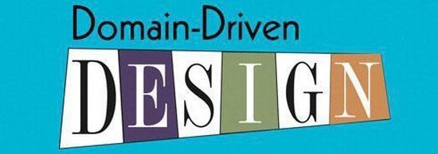
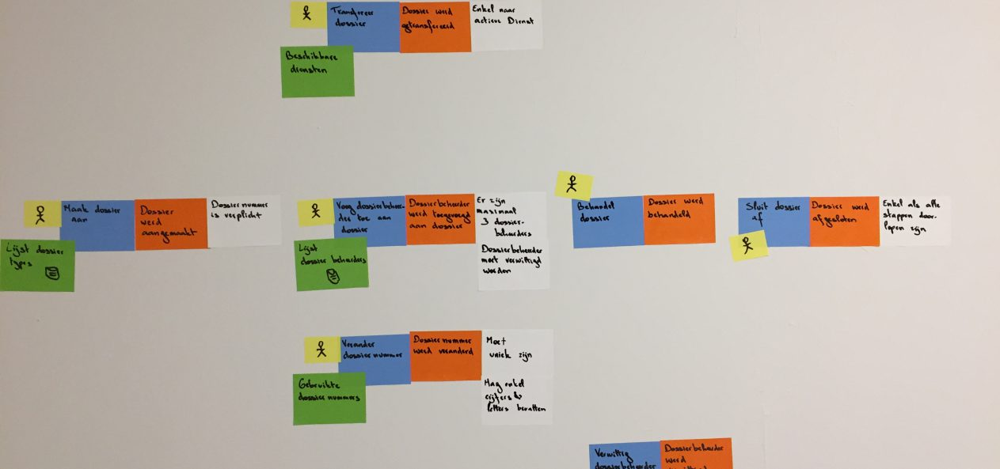

[Terug naar de hoofdpagina](../../Readme.md)

# Emerging Trends: Domain Driven Design (DDD)

## Inhoudsopgave

- [Emerging Trends: Domain Driven Design (DDD)](#emerging-trends-domain-driven-design-ddd)
  - [Inhoudsopgave](#inhoudsopgave)
  - [Probleemstelling](#probleemstelling)
  - [Vraagstukken](#vraagstukken)
  - [Resultaten](#resultaten)
    - [1. Wat is Domain Driven Design?](#1-wat-is-domain-driven-design)
    - [2. Wat zijn de voordelen?](#2-wat-zijn-de-voordelen)
    - [3. Hoe pas je het toe?](#3-hoe-pas-je-het-toe)
  - [4 Conclusie](#4-conclusie)

## Probleemstelling

Er zijn veel werkwijzen om software te ontwikkelen; Rapid Application Development, User Centered Design, Test Driven Development en Behavior Driven Development. Dit zijn prima werkwijzen, echter zorgen deze er vaak voor dat de software een grote spaghetti wordt. Er komen steeds meer functionaliteiten bij en de onderhoudbaarheid wordt steeds minder.

Hoe kan DDD gebruikt worden om een microservice applicatie te bouwen met veel stakeholders en eind gebruikers?

## Vraagstukken

Om de probleemstelling op te lossen, is het probleem opgedeeld in losse vraagstukken:

1. Wat is Domain Driven Design?
2. Wat zijn de voordelen?
3. Hoe pas je het toe?

## Resultaten

In dit hoofdstuk zijn de resultaten van bovenstaande vraagstukken te lezen.

### 1. Wat is Domain Driven Design?

DDD is in 2004 geïntroduceerd en populair gemaakt door programmeur Eric Evens met zijn boek Domain-Driven Design: Tackling Complexity in the Heart of Software.
Domain Driven Design is net als Test Driven Development en Behavior Driven Development een ontwerpstrategie. Bij DDD staat het domein centraal en is vooral bedoeld voor grootschalige projecten. Met DDD probeer je door middel van software een model te maken van een real-world system of proces. Je werkt nauw samen met de domein expert, diegene kent het domein en kan uitleg geven over hoe het echte systeem werkt. Als je dus software maakt voor een klaslokaal, werk je nauw samen met een docent.

Doordat deze domein expert normaliter geen developer is, wordt er een 'ubiquitous language (UL)' ontwikkeld. De UL is bedoeld om er voor te zorgen dat woorden binnen een bounded context voor iedereen dezelfde betekenis heeft. In het voorbeeld van het klaskokaal heeft het werkwoord 'lesgeven' voor zowel de domein expert als de developer dezelfde betekenis. Al is natuurlijk de implemantatie op een andere manier. Een bounded context is niks meer dan de omgeving die de betekenis van de woorden of uitspraken bepaald. Een klaslokaal heeft bijvoorbeeld andere eisen aan een deur, dan een garage.

Deze UL helpt ook bij het vormen van de basis van het object-oriented ontwerp. DDD heeft richtlijnen voor hoe objecten zich zouden moeten gedragen en deelt ze op in de volgende categoriën:

- Value Objects: Objecten welke een waarde representeren, bijvoorbeeld een leeftijd of datum.
- Entities: Dit zijn objecten met een identiteit, bijvoorbeeld een klant. Elke kant heeft zijn eigen identiteit om zich van anderen te kunnen onderscheiden.
- Aggerate Roots: Dit zijn objecten die andere objecten beheren. Dit werkt met het principe dat er objecten zijn die geen nut hebben zonder dat ze een ander 'parent' object hebben. Bijvoorbeeld, een student zonder klaslokaal zou niet logisch zijn. Het klaslokaal is de aggregate root en kan student objecten manipuleren.

### 2. Wat zijn de voordelen?

Een van de grote voordelen van DDD is dat zowel de software mensen als de business mensen met hetzelfde model en dezelfde taal werken. Dit zorgt ervoor dat de technische en niet technische mensen makkelijker kunnen communiceren en efficiënter tot oplossingen kunnen komen. Er wordt meer besproken hoe een business proces verloopt in plaats van hoe de software werkt.

In het begin van het ontwikkelproces wordt de terminologie besproken en vastgesteld, oftewel de UL. Deze taal wordt gekoppeld aan het domein model van het project en de technische aspecten worden vertaald naar simpele termen die iedereen begrijpt.
Doordat iedereen dezelfde terminologie gebruikt valt ook makkelijker vast te stellen of de requirements zijn geïmplementeerd.

Andere voordelen zijn:

1. **De organisatie krijgt een nuttig model van zijn domein**
   De nadruk van DDD ligt op dat ontwikkelen wat het belangrijkst is voor de organisatie. Er worden geen onnodige modellen gemaakt, maar de focus ligt alleen op het `core domain`. Andere modellen bestaan alleen om dit core domain te ondersteunen. Ondanks dat deze ondersteunende modellen erg belangrijk zijn, ligt de prioriteit op deze modellen wat lager.

2. **Een duidelijke definitie wordt ontwikkeld**
   De organisatie krijgt mogelijk een beter begrip van haar eigen missie en doelen. De kans is aanwezig dat de UL wat voor het core domain is ontwikkeld, zijn weg vindt naar marketing doeleinden. Naarmate het model verder verfijnd wordt, ontwikkelt de organisatie meer begrip dat gebruikt kan worden als analyse tool.

3. **Domein experts werken mee aan het ontwerp**
   Domein experts zijn het niet altijd eens met de concepten en gekozen termen. Deze verschillen komen vaak voort uit eigen ervaring bij andere bedrijven. Dankzij deze domein experts krijgen de ontwikkelaars een gemeenschappelijke taal die overeenkomt met de business processen uit de echte wereld. Dit verkleint ook de kans dat alleen een selecte groep van de ontwikkelaars diepgaande kennis opdoet.

4. **Betere user experience**
   Vaak kan de UX verbeterd worden door het domein model beter toe te passen. Wanneer de software te veel open laat en de gebruikers naar eigen interpretatie gegevens in laat vullen, is het waarschijnlijk dat de gegevens incorrect of niet bruikbaar zijn. Wanneer de UX zo gemaakt is dat het procies de contouren van het domein model volgt, zullen gebruikers minder zelf hoeven te gokken en zal de data correctheid een stuk hoger liggen.

5. **Duidelijke grenzen om modellen**
   Het ontwikkelteam wordt afgeraden om software te schrijven volgens hun eigen strategiën. Hun verwachtingen van de software moet in lijn liggen met de business voordelen. Wanneer de denkwijze in lijn ligt met deze voordelen, worden betere en makkelijkere oplossing bedacht.

6. **Beter georganiseerde enterprise architectuur**
   Wanneer de bounded contexts duidelijk worden begrepen en goed afgebakend zijn, zullen alle teams goed begrijpen waarom en waar integraties nodig zijn. Deze grenzen en de relaties hiertussen zijn expliciet. De teams die modellen hebben die met andere modellen een verbinding hebben, maken een Context Map om duidelijk de formele relaties aan te geven en deze te integreren. Dit zorgt voor een duidelijk begrip van de architectuur.

### 3. Hoe pas je het toe?

Het implementeren van DDD is vrij eenvoudig, het refactoren naar DDD kan (afhankelijk van de huidige implementatie) wel lastiger zijn. Onnodige modellen en relaties zullen aangepast moeten worden.

In het begin wordt samen met de product owner en domein experts event storm sessies gehouden. Het doel van event storming is om alle business processen in kaart te brengen. Dit wordt gedaan door op een grote lege muur, vele post-its te plakken. De muur dient als tijdlijn van links naar rechts. Er worden geen technische termen gebruikt, alleen de taal van het domein.
Op deze manier wordt ook de UL vastgesteld, zodat iedereen dezelfde terminologie gebruikt.

Het nadeel hiervan is wel dat er meer tijd nodig is om het domein goed te begrijpen dankzij alle gesprekken met de domein experts. Ook het bepalen can sub-domeinen en context grenzen kan veel tijd in beslag nemen.

Verder volg DDD de standaard agile werkwijze, dus scrum of kanban kan gewoon worden toegepast.

## 4 Conclusie

Om de vraag "Hoe kan DDD gebruikt worden om een microservice applicatie te bouwen met veel stakeholders en eind gebruikers?" te beantwoorden zijn de drie deelvragen beantwoord:

1. Wat is Domain Driven Design?
2. Wat zijn de voordelen?
3. Hoe pas je het toe?

DDD is een techniek dat het domein centraal zet. Samen met domein experts wordt er voor gezorgd dat iedereen dezelfde UL spreekt en termen gebruikt die iedereen kan begrijpen. Doordat het domein real-world processen weerspiegelen, maakt dat het uitbreiden ook erg eenvoudig en zal de software het langer overleven.

Deze UL maakt het ook mogelijk voor stakeholders om met de technische mensen te communiceren. Doordat ze in de taal van het domein met elkaar spreken, hebben stakeholders duidelijk door welke requirements al geïmplementeerd zijn en waar de moeilijkheden liggen.

Ook voor eindgebruikers biedt DDD voordelen. Wanneer het domein model met behulp van de experts goed vastgesteld is en de software het model goed representeert, is het ook voor gebruikers een stuk duidelijker wat er qua gegevens verwacht wordt.

Er moet echter wel kritisch gekeken worden of DDD wel daadwerkelijk nodig is. Wanneer de applicatie een standaard CRUD applicatie is, of dat data centraal staat, is de kans groot dat het implementeren van DDD niet ideaal. DDD is een goede aanpak om een applicatie te versimpelen, maar als de versimpeling niet nodig is, dan is de implementatie van DDD ook niet nodig.

Om de hoofdvraag goed te kunnen beantwoorden, moet eerst het type applicatie worden vastgesteld. Wanneer het een CRUD applicatie is, is DDD overbodig. Is het veel complexer dan dat, dan kan het zeker helpen met het verbeteren van de kwaliteit van de applicatie.
