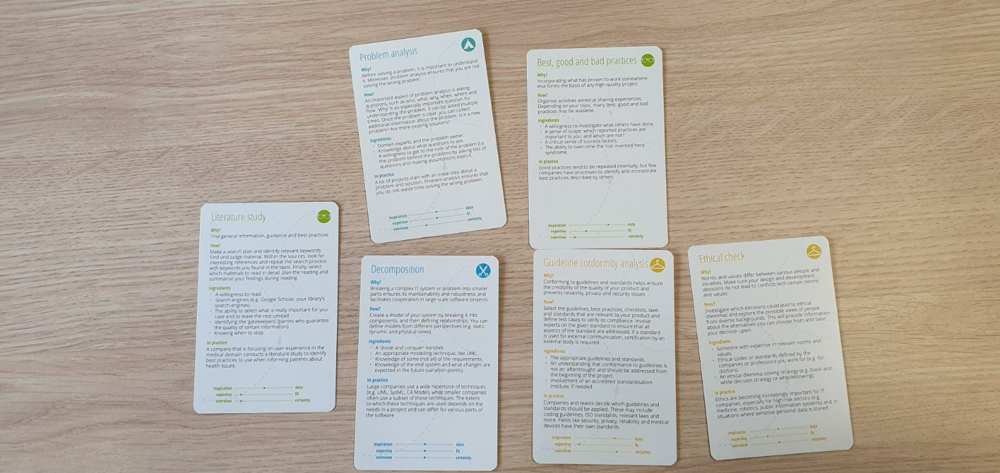
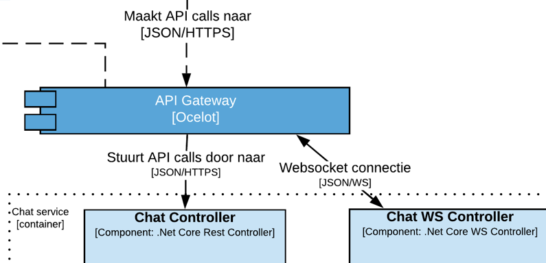
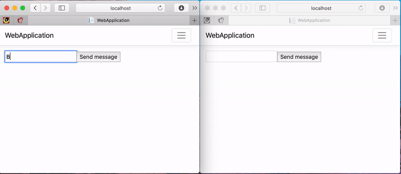
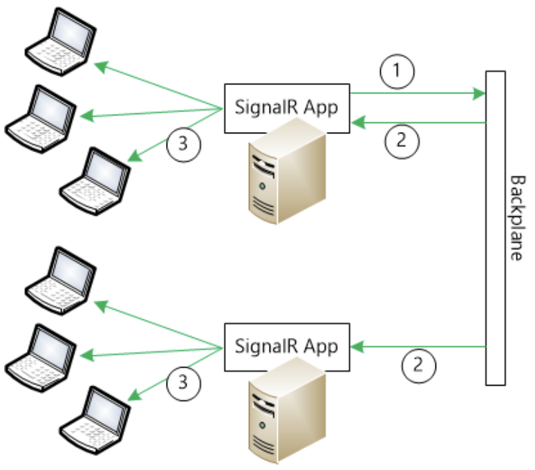
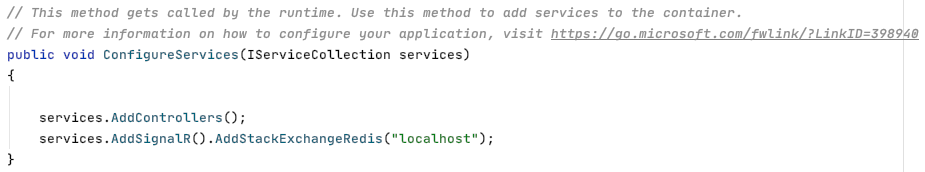
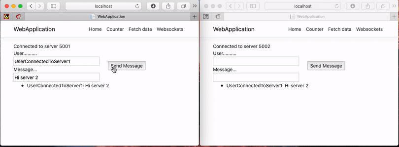

[Terug naar de hoofdpagina](../../Readme.md)

## Onderzoek schaalbaarheid WebSockets

# Inhoudsopgave

- [Inhoudsopgave](#inhoudsopgave)
- [Introductie](#introductie)
- [Aanpak](#aanpak)
- [Resultaten](#resultaten)
  - [Hoe gaat de API gateway om met websockets?](#hoe-gaat-de-api-gateway-om-met-websockets)
    - [Configuratie](#configuratie)
      - [Gateway](#gateway)
      - [API](#api)
- [Wat is het verschil tussen een REST en een WebSocket service?](#wat-is-het-verschil-tussen-een-rest-en-een-websocket-service)
    - [Stateful](#stateful)
    - [Stateless](#stateless)
- [Wat is er voor nodig om het opschalen mogelijk te maken?](#wat-is-er-voor-nodig-om-het-opschalen-mogelijk-te-maken)
    - [Prototypes](#prototypes)
      - [Redis Backplane:](#redis-backplane)
- [Conclusie](#conclusie)
- [Reflectie](#reflectie)
- [Bronvermelding](#bronvermelding)

# Introductie

Om gebruikers van The Gram met elkaar in contact te laten komen, zit er chat functionaliteit in de applicatie. Om ervoor te zorgen dat de berichten real-time verstuurd en ontvangen kunnen worden, zonder dat de gebruiker handmatig hoeft te verversen, wordt er gebruik gemaakt van websockets.

Wanneer een grote hoeveelheid mensen de applicatie gebruiken zal de API service mee moeten schalen. Om de hoofdvraag <b>“Hoe schaal ik mijn websockets horizontaal bij met hogere load?”</b> te beantwoorden, zijn de volgende deelvragen opgesteld:

- Hoe gaat de API gateway met websockets om?
- Wat is het verschil tussen een REST en een WebSocket service?
- Wat is er voor nodig om het opschalen mogelijk te maken?

# Aanpak


Voor het onderzoek is er gebruik gemaakt van de ICT researchmethods (The DOT Framework, 2018). Het DOT-framework biedt een goede manier om de verschillen en overeenkomsten tussen verschillende onderzoeksmethoden te begrijpen, zodat je combinaties van methodes kunt kiezen. De volgende technieken van het DOT-framework worden gebruikt om de deelvragen te beantwoorden.

| Techniek                                                                                                                                                                                        | Deelvraag                                                                                                                                                                                                                                                                                              |
| ----------------------------------------------------------------------------------------------------------------------------------------------------------------------------------------------- | ------------------------------------------------------------------------------------------------------------------------------------------------------------------------------------------------------------------------------------------------------------------------------------------------------ |
|  Problem analysis <br>  Community Research <br>Prototyping | 1. Hoe gaat de API gateway met websockets om? <br><br>Als eerste wordt het probleem geanalyseerd. Op basis van deze analyse wordt bekeken of andere mensen in een online community hier ook tegenaan gelopen zijn. Op basis van deze bevindingen wordt er een prototype gemaakt.                       |
|  Problem analysis <br>  Literature study                                                                | 2. Wat is het verschil tussen een REST en een WebSocket service?<br><br>Als eerste wordt het probleem geanalyseerd. Daarna kijk ik door documentatie te lezen hoe de state wordt geïmplementeerd en noteer ik mijn bevindingen.                                                                        |
|  Problem analysis <br>  Literature study <br>Prototyping   | 3. Wat is er voor nodig om het opschalen mogelijk te maken? <br><br>Als eerste wordt het probleem geanalyseerd. Door het maken van een prototype kan ik eenvoudig zien wat er gebeurd als de load zwaarder wordt. Door benchmark en non-functional tests uit te voeren kan ik de prestatiewinst meten. |

# Resultaten

In dit hoofdstuk zijn de bevindingen per deelvraag te lezen. Ik zal de aanpak verder toelichten evenals de resultaten.

## Hoe gaat de API gateway om met websockets?


De client (SwiftUI applicatie) zal nooit rechtstreeks een microservice benaderen. Alle requests komen binnen via de API gateway. In dit geval is dat een Ocelot gateway. Het plaatje hierboven geeft een klein beeld van de architectuur. Een API gateway biedt normaliter alleen ondersteuning voor request/response berichten en is een constante verbinding niet wenselijk. Hier ben ik erg tegenaan gelopen met de Netflix Zuul Gateway, maar hoe gaat Ocelot er mee om?

Waar bij de upgrade van Zuul 1 naar Zuul 2 (welke het wel mogelijk maakte om websockets te gebruiken) het nodig was om de volledige service asynchroon en non-blocking te maken, schijnt het bij Ocelot een stuk eenvoudiger te gaan.

Ocelot biedt ondersteuning voor SignalR (Pallister, 2016) en de backend te herschrijven naar een non-blocking service is niet nodig. Om de werking te testen heb ik een prototype gemaakt. De Solution bevat de Ocelot gateway, een Web API en een Web Application met React. Aan de hand van de officiële guide (Microsoft, 2019a) zijn de API en Web Application geconfigureerd. Op wat CORS problemen, die opgelost zijn dankzij een post op StackOverflow (Dangalla, 2019) , na was het opzetten beduidend eenvoudiger dan met Springboot icm Zuul.

### Configuratie

#### Gateway

In de configuratie van de gateway is het alleen noodzakelijk om de juiste route mee te geven:

Alle requests van het type websocket naar `/chathub` op de gateway worden naar `localhost:5002/chathub` doorgestuurd.

```
    {
      "DownstreamPathTemplate": "/chathub",
      "UpstreamPathTemplate": "/chathub",
      "DownstreamScheme": "ws",
      "DownstreamHostAndPorts": [
        {
          "Host": "localhost",
          "Port": 5002
        }
      ]
    }
```

#### API

Voor de API moesten er twee dingen toegevoegd worden:
In de startup de volgende regel toevoegen bij ConfigureService:
`services.AddSignalR();`

En bij de routing:
`endpoints.MapHub<ChatHub>("/chatHub");`

ChatHub is een eigen class die de logica voor de ontvangen berichten bevat:

```
public class ChatHub : Hub
{
    public async Task SendMessage(string message)
    {
        await Clients.All.SendAsync("ReceiveMessage",message);
    }
}
```

Wat resulteert in een werkende websocket applicatie:


# Wat is het verschil tussen een REST en een WebSocket service?

Om de hoofdvraag te beantwoorden, is het noodzakelijk om te weten waarom de hoofdvraag überhaupt gesteld wordt. Het opschalen van een REST service is immers geen probleem, maar het schalen van een websocket service kan een uitdaging vormen. De reden waarom het met websockets een uitdaging kan zijn, is vanwege de architectuur van de service. Een RESTful service is stateless, waar een websocket service juist stateful is (Educba, 2018).

### Stateful

Een state is simpelweg de status van een entiteit op een bepaalde tijd. Een stateful service zal dus op basis van deze state, een response geven. Simpel voorbeeld, als er een boolean variabele is die elke vijf seconde van waarde switcht, zal het antwoord op een request afhankelijk zijn van de boolean waarde op dat moment. Je kan onmogelijk van te voren voorspellen wat het antwoord zal zijn, zonder afhankelijk van de state te zijn.

### Stateless

Een stateless service is het tegenovergestelde van een stateful service. Elke request is op zichzelf staand en alleen afhankelijk van de data die meegestuurd wordt. Wanneer eenzelfde GET request 10 keer gedaan wordt, zal er ook 10 keer hetzelfde antwoord terugkomen (mits er buiten deze requests niks wordt gedaan).

Doordat de websocket service een state bijhoudt, bijvoorbeeld een chatroom of iets dergelijks, is het horizontaal schalen lastig. Een gebruiker van server instantie A ziet dan niet de berichten van een gebruiker van server instantie B. Er is dus geen communicatie tussen de twee instanties.

# Wat is er voor nodig om het opschalen mogelijk te maken?

Nu in kaart gebracht is hoe een websocket service in elkaar steekt en wat de complicaties zijn die daarbij horen, rest nog de vraag wat er dan voor nodig is om het opschalen wel mogelijk te maken?
Er zijn twee manieren om de service op te schalen:

- Een grotere server (of VM) met meer RAM, CPU etc gebruiken (scale up)
- Een extra server / instantie starten om de load te verdelen (scale out)

Bij de eerste optie loop je al snel tegen de grenzen van de machine aan, dan moeten er servers / instanties bij komen. Zoals gezegd loop je dan tegen het probleem aan dat gebruikers die verbonden zijn met server 1 niet de berichten ontvangen die verstuurd zijn met server 2. Om dit op te lossen is een “backplane” nodig (Microsoft, 2014). Wanneer een backplane is toegevoegd, zal iedere applicatie instantie zijn berichten naar de backplane sturen en de backplane stuurt deze berichten dan weer door naar andere applicatie instanties.


Voor SignalR Core zijn er momenteel voor drie aanbieders ondersteuning (Microsoft, 2020):

- Azure SignalR Service: Een proxy die alle communicatie beheert. Gebruikers sturen berichten via de proxy naar de juiste service.
- Redis: Redis is een in-memory key-value opslag. Redis biedt ondersteuning aan het “pub/sub” patroon om berichten te versturen

### Prototypes

Van de Azure SignalR service kan ik helaas zelf geen prototype maken in verband met de kosten. Als ik de guide van microsoft bekijk (Microsoft, 2019b) is het qua configuratie doodsimpel. Je maakt een nieuwe app service aan, waarbij je de “Azure SignalR Service” als Dependency toevoegt en dan wordt verder alles geregeld achter de schermen.

#### Redis Backplane:

Als eerste de installatie van Redis via homebrew `$ brew install redis` en wordt gestart met `brew services start redis`.

De enige verdere configuratie die benodigd is, is de `Microsoft.AspNetCore.SignalR.StackExchangeRedis` Package toevoegen aan het SignalR project en in de ConfigureServices methode in Startup.cs deze regel toe te voegen `services.AddSignalR().AddStackExchangeRedis(“localhost”);`. Localhost is de server waar Redis op draait.


Het wordt streng aangeraden om de Redis server in hetzelfde datacenter te hosten als waar de applicatie instanties draaien om netwerk vertraging te minimaliseren.

Voor mijn prototype heb ik twee API instanties gestart op poort 5001 en 5002. In de productieomgeving zal dit niet handmatig gedaan worden, maar automatisch. Beide applicaties maken verbinding met dezelfde Redis server die op localhost draait.

In onderstaande video zijn twee browsers te zien. De linker is met de instantie op poort 5001 verbonden, de rechter met de instantie op poort 5002. Zonder Redis zou de rechter browser niet de berichten ontvangen die de linker browser verstuurd. Dankzij Redis dus wel.


# Conclusie

In eerste instantie werd ik lichtelijk ontmoedigd om websockets gebruiken doordat het een hele uitdaging leek om de API schaalbaar te maken. Bovendien was mijn ervaring met Spring in combinatie met websockets en een API gateway niet al te positief, maar gelukkig is mijn beeld veranderd.

Om de hoofdvraag <b>“Hoe schaal ik mijn websockets horizontaal bij met hogere load?”</b> te beantwoorden heb ik de volgende deelvragen beantwoord:

- Hoe gaat de API gateway met websockets om?
- Wat is het verschil tussen een REST en een WebSocket service
- Wat is er voor nodig om het opschalen mogelijk te maken?

In tegenstelling tot Zuul of Spring Cloud Gateway gaat Ocelot erg goed om met websockets. Er hoeft alleen in het configuratiebestand de juiste host en poort toegevoegd te worden welke naar de websocket service linkt. Dit werkt ook prima in combinatie met normale rest endpoints.

Doordat een websocket service een stateful service is, zal het horizontaal schalen niet automatisch goed gaan. Een stateful service houdt namelijk in, dat de service bepaalde informatie bijhoudt in zijn lokale cache geheugen. Bijvoorbeeld actieve chatrooms. Service instantie 1 kan dus niet direct bij de chatrooms van service instantie 2 en vice versa.

Om dit dan toch mogelijk te maken, is een extra service nodig: een backplane. Een backplane service is een service die naast de API instanties draait. Elke keer dat een API instantie een bericht binnenkrijgt, stuurt hij deze door naar de backplane welke er voor zorgt dat de andere API instanties deze berichten ook krijgt.

Ik maak gebruik van SignalR core, en hier zijn twee backplane services voor beschikbaar: Redis en Azure SignalR Service. Doordat ik voor Google Cloud Platform (GCP) als mijn cloud provider gekozen heb, valt de Azure SignalR service sowieso af. Uit mijn prototype van de Redis backplane is gebleken dat dit erg soepel werkt. Ik zal dus een Redis service hosten in mijn GCP omgeving, zodat de API instanties hier gebruik van kunnen maken zodra het nodig is om extra instanties aan te maken.

# Reflectie

Vóór dit onderzoek had ik alleen nog maar ervaring met websockets in springboot en kon ik mij de problemen met de gateway erg goed herinneren nog. Dankzij het onderzoek heb ik nu ook een duidelijk beeld hoe ik de websockets in mijn project kan integreren in combinatie met het bijschalen van deze services. De configuratie is erg eenvoudig en alles is netjes gedocumenteerd. Mochten er onverhoopt toch iets niet werken dan is er online genoeg over te vinden aangezien zowel SignalR als Ocelot erg veel gebruikt worden. Ik heb mij in dit onderzoek beperkt tot het opzetten van een web applicatie, maar er zijn ook library’s voor Swift te vinden zodat ik de server in ieder geval op dezelfde manier kan inrichten als de prototypes.

# Bronvermelding

- Pallister, T. (2016). Websockets - Ocelot. Geraadpleegd van https://ocelot.readthedocs.io/en/latest/features/websockets.html
- Microsoft. (2019a, 21 november). Get started with ASP.NET Core SignalR. Geraadpleegd van https://docs.microsoft.com/en-us/aspnet/core/tutorials/signalr?view=aspnetcore-3.1&tabs=visual-studio
- Dangalla, R. [Rukshan D. (2019, 26 mei). Angular/SignalR Error: Failed to complete negotiation with the server [Forumpost]. Geraadpleegd van https://stackoverflow.com/a/56316161
- Educba. (2018, 7 november). WebSocket vs REST. Geraadpleegd van https://www.educba.com/websocket-vs-rest/
- Microsoft. (2020, 17 januari). Introduction to Scaleout in SignalR. Geraadpleegd van https://docs.microsoft.com/en-us/aspnet/core/signalr/scale?view=aspnetcore-3.1
- Microsoft. (2019b, 12 november). Publish an ASP.NET Core SignalR app to Azure App Service. Geraadpleegd van https://docs.microsoft.com/en-us/aspnet/core/signalr/publish-to-azure-web-app?view=aspnetcore-3.1
